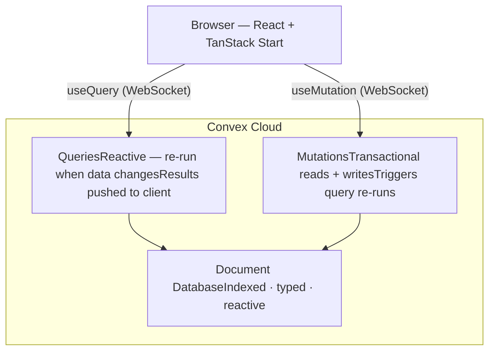

# Module 02 — Adding Convex: First Real-Time Data

> **What you'll see running:** A simple messages demo where you post a message in one browser tab and it appears instantly in another — zero WebSocket code, zero polling.

## What Convex Is (and Isn't)

Convex is a **backend-as-a-service** that replaces your database, server, ORM, real-time infrastructure, and job queue with a single system. You write TypeScript functions; Convex runs them.

### What You Don't Need Anymore

| Traditional Backend     | With Convex              |
|-------------------------|--------------------------|
| Express/Hono server     | Not needed — Convex hosts your functions |
| PostgreSQL/MySQL        | Convex document database (built-in) |
| Prisma/Drizzle ORM      | `ctx.db` API directly    |
| SQL migrations          | Declarative schema (no migrations) |
| Redis/BullMQ for jobs   | `ctx.scheduler` (built-in) |
| WebSocket server        | Every query is a real-time subscription |
| Elasticsearch           | Built-in search indexes  |

### The Three Function Types

Convex has exactly three kinds of server functions:

| Type | Purpose | Properties |
|------|---------|-----------|
| **Query** | Read data | Reactive (clients auto-subscribe), deterministic, no side effects |
| **Mutation** | Write data | Transactional (all-or-nothing), can read and write |
| **Action** | Side effects | Can call external APIs, not transactional, can call queries/mutations |

This is the core mental model. Everything in Convex is one of these three.

## Install Convex

```bash
bun add convex
bunx convex init
```

`convex init` creates:

```
flat-earth/
├── convex/
│   ├── _generated/       # Auto-generated types (don't edit)
│   │   ├── api.d.ts
│   │   ├── dataModel.d.ts
│   │   └── server.d.ts
│   ├── schema.ts         # Your database schema (empty initially)
│   └── tsconfig.json     # TypeScript config for convex/
└── .env.local            # VITE_CONVEX_URL=https://your-project.convex.cloud
```

### Start the Convex Dev Server

```bash
bunx convex dev
```

This watches your `convex/` directory, pushes changes to Convex Cloud, and generates TypeScript types from your schema. Keep this running in a terminal while developing.

## Validators (`v`)

Before writing schema or functions, understand Convex's runtime validation library:

```typescript
import { v } from "convex/values";

// Primitives
v.string()                              // string
v.number()                              // number
v.boolean()                             // boolean
v.null()                                // null

// Composites
v.array(v.string())                     // string[]
v.object({ name: v.string() })          // { name: string }
v.optional(v.string())                  // string | undefined
v.union(v.string(), v.number())         // string | number

// Special
v.id("tableName")                       // Id<"tableName"> — typed document reference
v.literal("active")                     // the exact string "active"
```

These validators serve double duty: they define your schema types AND validate data at runtime.

## Your First Schema

```typescript
// convex/schema.ts
import { defineSchema, defineTable } from "convex/server";
import { v } from "convex/values";

export default defineSchema({
  messages: defineTable({
    author: v.string(),
    body: v.string(),
  }),
});
```

Save. `convex dev` pushes the schema and generates types for your `messages` table.

## Your First Query

```typescript
// convex/messages.ts
import { query } from "./_generated/server";

export const list = query({
  args: {},
  handler: async (ctx) => {
    return ctx.db
      .query("messages")
      .order("desc")
      .take(50);
  },
});
```

- `query({...})` — defines a read-only, reactive function
- `args: {}` — no arguments needed
- `ctx.db.query("messages")` — query the messages table
- `.order("desc")` — newest first
- `.take(50)` — limit to 50 results

## Your First Mutation

```typescript
// convex/messages.ts (add to the same file)
import { query, mutation } from "./_generated/server";
import { v } from "convex/values";

// ... list query above ...

export const send = mutation({
  args: {
    author: v.string(),
    body: v.string(),
  },
  handler: async (ctx, args) => {
    await ctx.db.insert("messages", {
      author: args.author,
      body: args.body,
    });
  },
});
```

If a mutation throws, all writes are rolled back automatically. No transaction blocks needed.

## The `ctx` Object

Every Convex function receives a context object:

| Property | Query | Mutation | Action |
|----------|-------|----------|--------|
| `ctx.db` | read-only | read + write | — |
| `ctx.auth` | yes | yes | yes |
| `ctx.scheduler` | — | yes | yes |

Key insight: queries can only read. Mutations can read and write but can't call external APIs. Actions can do anything but aren't transactional.

## Wire Convex to the Frontend

### Add the ConvexProvider

Update your root layout to wrap the app with Convex's React provider:

```tsx
// src/routes/__root.tsx
import { createRootRoute, Outlet } from "@tanstack/react-router";
import { ConvexProvider, ConvexReactClient } from "convex/react";
import "../styles.css";

const convex = new ConvexReactClient(
  import.meta.env.VITE_CONVEX_URL as string
);

function RootComponent() {
  return (
    <ConvexProvider client={convex}>
      <html lang="en">
        <head>
          <meta charSet="utf-8" />
          <meta name="viewport" content="width=device-width, initial-scale=1" />
          <title>Flat Earth</title>
        </head>
        <body className="bg-gray-50 text-gray-900 antialiased">
          <Outlet />
        </body>
      </html>
    </ConvexProvider>
  );
}

export const Route = createRootRoute({
  component: RootComponent,
});
```

### Build a Messages Demo Page

```tsx
// src/routes/index.tsx
import { createFileRoute } from "@tanstack/react-router";
import { useQuery, useMutation } from "convex/react";
import { api } from "../../convex/_generated/api";
import { useState } from "react";
import { Button } from "../components/ui/button";
import {
  Card,
  CardHeader,
  CardTitle,
  CardContent,
} from "../components/ui/card";

export const Route = createFileRoute("/")({
  component: HomePage,
});

function HomePage() {
  const messages = useQuery(api.messages.list);
  const sendMessage = useMutation(api.messages.send);
  const [author, setAuthor] = useState("");
  const [body, setBody] = useState("");

  const handleSend = async () => {
    if (!author.trim() || !body.trim()) return;
    await sendMessage({ author: author.trim(), body: body.trim() });
    setBody("");
  };

  return (
    <div className="mx-auto max-w-lg p-8">
      <Card>
        <CardHeader>
          <CardTitle>Real-Time Messages</CardTitle>
        </CardHeader>
        <CardContent className="space-y-4">
          {/* Message form */}
          <div className="flex gap-2">
            <input
              className="flex-1 rounded border px-3 py-2 text-sm"
              placeholder="Your name"
              value={author}
              onChange={(e) => setAuthor(e.target.value)}
            />
          </div>
          <div className="flex gap-2">
            <input
              className="flex-1 rounded border px-3 py-2 text-sm"
              placeholder="Type a message..."
              value={body}
              onChange={(e) => setBody(e.target.value)}
              onKeyDown={(e) => e.key === "Enter" && handleSend()}
            />
            <Button onClick={handleSend}>Send</Button>
          </div>

          {/* Message list */}
          <div className="space-y-2 pt-4">
            {messages === undefined ? (
              <p className="text-sm text-gray-500">Loading...</p>
            ) : messages.length === 0 ? (
              <p className="text-sm text-gray-500">No messages yet.</p>
            ) : (
              messages.map((msg) => (
                <div
                  key={msg._id}
                  className="rounded bg-gray-100 p-3 text-sm"
                >
                  <span className="font-medium">{msg.author}:</span>{" "}
                  {msg.body}
                </div>
              ))
            )}
          </div>
        </CardContent>
      </Card>
    </div>
  );
}
```

### `useQuery` and `useMutation`

- `useQuery(api.messages.list)` — subscribes to the query. Returns `undefined` while loading, then the result. Updates automatically when data changes.
- `useMutation(api.messages.send)` — returns a function you call with arguments. After the mutation succeeds, any affected queries re-run and push new data to all subscribers.

## The Real-Time Demo

1. Start both servers: `bunx convex dev` in one terminal, `bun dev` in another
2. Open `http://localhost:3000` in **two browser tabs**
3. Type a name and message in Tab 1, click Send
4. Watch the message appear **instantly** in Tab 2

No polling. No manual invalidation. No WebSocket channels. The query *is* the subscription.

### How Reactivity Works

1. Tab 1 calls `useMutation(api.messages.send, { author: "Alice", body: "Hello" })`
2. The mutation inserts a document into `messages`
3. Convex detects that `messages.list` reads from the `messages` table
4. Convex re-runs `messages.list`
5. The new result is pushed to **all** clients subscribed to `messages.list`
6. Both tabs re-render with the new message

## Architecture Mental Model



## Database Operations Reference

### Reading

```typescript
// Get by ID
const msg = await ctx.db.get(messageId);  // Doc<"messages"> | null

// Query all
const all = await ctx.db.query("messages").collect();

// Newest first, take 5
const latest = await ctx.db.query("messages").order("desc").take(5);

// First match
const first = await ctx.db.query("messages").first();
```

### Writing (mutations only)

```typescript
// Insert — returns the new document's ID
const id = await ctx.db.insert("messages", { author: "Alice", body: "Hi" });

// Patch — update specific fields
await ctx.db.patch(messageId, { body: "Updated" });

// Replace — overwrite entire document
await ctx.db.replace(messageId, { author: "Alice", body: "Replaced" });

// Delete
await ctx.db.delete(messageId);
```

## TypeScript in Context: Async/Await

Every Convex function handler is async. If you've used async/await in Python, Java, C#, or JavaScript, it works identically:

```typescript
async function fetchAndProcess(ctx: QueryCtx): Promise<string[]> {
  const messages = await ctx.db.query("messages").collect();
  return messages.map((m) => m.body);
}
```

- `async` marks a function as returning a `Promise`
- `await` pauses until the promise resolves
- Use `Promise.all` for parallel fetches:

```typescript
const [board, user] = await Promise.all([
  ctx.db.get(boardId),
  ctx.db.get(userId),
]);
```

## Function Organization

Convex functions are organized by file. The file path becomes the API path:

```
convex/
├── messages.ts          → api.messages.list, api.messages.send
├── boards.ts            → api.boards.list, api.boards.create
├── cards.ts             → api.cards.list, api.cards.create
└── cards/
    └── lifecycle.ts     → api.cards.lifecycle.close
```

## The Convex Dashboard

Test functions without writing frontend code:

```bash
bunx convex dashboard
```

Or visit `https://dashboard.convex.dev` and select your project. You can browse data, run functions with arguments, and view logs.

## Exercise

1. Install Convex and run `bunx convex init`
2. Define a `messages` schema with `author` and `body` fields
3. Write a `list` query and `send` mutation
4. Add `ConvexProvider` to your root layout
5. Build the messages demo page with `useQuery` and `useMutation`
6. Open two browser tabs and verify messages sync in real time
7. Try the Convex dashboard: run `messages:send` and watch the UI update

**Result:** Two browser tabs showing the same data, syncing in real time with zero infrastructure code.

---

Next: [Module 03 — Authentication with Clerk](./03-authentication.md)
