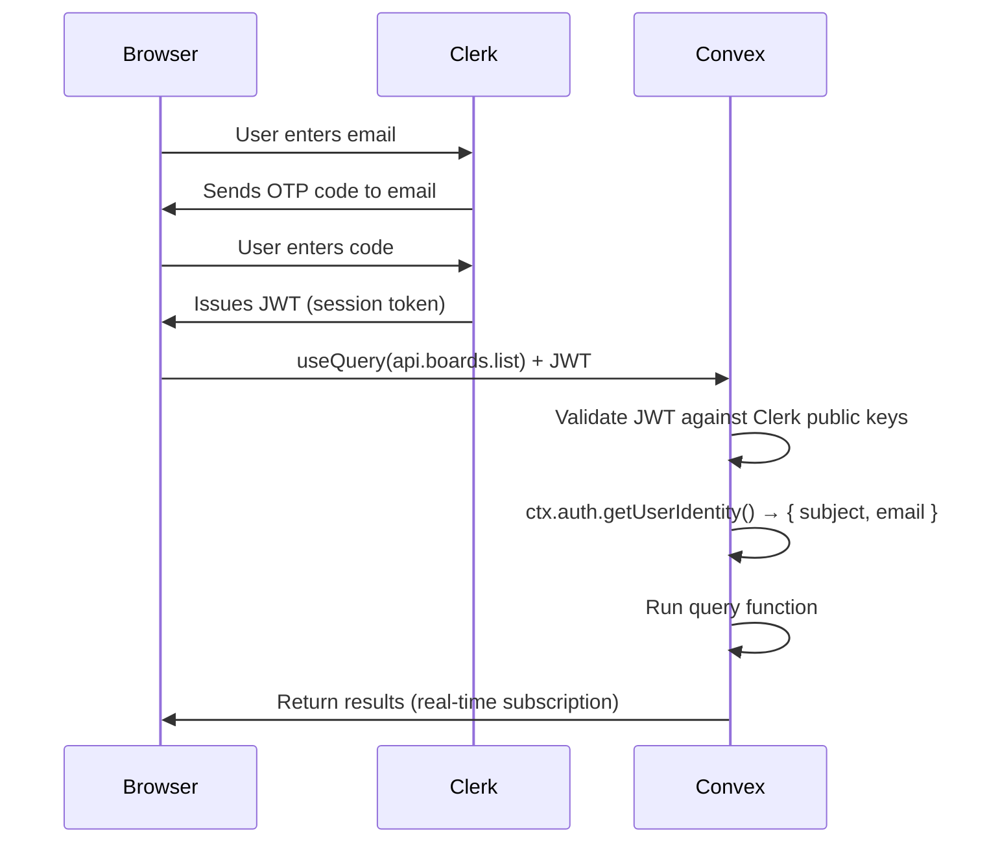

# Module 03 — Authentication with Clerk

> **What you'll see running:** A sign-in page with email OTP, protected routes that redirect unauthenticated users, and your identity displayed in the UI after login.
>
> **Reference:** [docs/fizzy-analysis/03-authentication-and-sessions.md](../fizzy-analysis/03-authentication-and-sessions.md)

## How Fizzy Does It (And Why We Don't)

Fizzy implements custom passwordless authentication from scratch — six database tables, magic link controllers, signed cookies, encrypted cookies, rate limiting, and a cleanup job for expired codes. That's ~300 lines of carefully written security code.

We replace all of it with Clerk: zero auth tables, zero security plumbing.

| Fizzy Table | What It Does | Clerk Replacement |
|-------------|-------------|-------------------|
| `identities` | Stores email, verified flag | Clerk User (hosted) |
| `sessions` | Tracks browser sessions | Clerk session management |
| `magic_links` | Short-lived 6-digit codes | Clerk email OTP |
| `signups` | Registration state machine | Clerk sign-up flow |
| `access_tokens` | API bearer tokens | Clerk API tokens |
| `join_codes` | Invitation links | We handle this ourselves in Module 04 |

**Result:** 6 auth tables → 0 auth tables. The `Authentication` concern, signed cookies, encrypted cookies, secure comparison, rate limiting, and cleanup jobs all disappear.

## Setup Clerk

### 1. Create a Clerk Application

Go to [clerk.com](https://clerk.com), create an account, create a new application.

In the Clerk dashboard:
- **Application name:** Flat Earth
- **Sign-in options:** Enable **Email address** only
- **Email verification:** Enable **Email code** (mimics Fizzy's magic link behavior)
- Disable password, username, phone, and social sign-in

### 2. Get Your Keys

From the Clerk dashboard, copy:
- **Publishable Key** (starts with `pk_`)
- **Clerk Domain** (e.g., `your-app.clerk.accounts.dev`)

### 3. Install Clerk

```bash
bun add @clerk/clerk-react @clerk/tanstack-start
```

### 4. Set Environment Variables

Add to `.env.local`:

```
VITE_CLERK_PUBLISHABLE_KEY=pk_test_your-key-here
```

## Configure Convex + Clerk

### 1. Auth Config

Create the Convex auth configuration:

```typescript
// convex/auth.config.ts
export default {
  providers: [
    {
      domain: process.env.CLERK_ISSUER_URL,
    },
  ],
};
```

### 2. Set Convex Environment Variable

Get the Issuer URL from Clerk:

1. In the Clerk dashboard → **JWT Templates** (left sidebar)
2. Click **New template** → select **Convex**
3. The **Issuer** URL is displayed (e.g., `https://verb-noun-00.clerk.accounts.dev`)
4. Save the template — the JWT token name must remain `convex`

Set it in Convex:

```bash
bunx convex env set CLERK_ISSUER_URL https://verb-noun-00.clerk.accounts.dev
```

### 3. How It Works

```
1. User signs in with Clerk (browser)
2. Clerk issues a JWT
3. Client sends JWT with every Convex request (automatic)
4. Convex validates the JWT against Clerk's public keys
5. Your functions access the identity via ctx.auth
```

You write none of this plumbing. Convex and Clerk handle the JWT exchange automatically.

## Wire Up the Providers

Update your root layout to wrap with both Clerk and Convex:

```tsx
// src/routes/__root.tsx
import { createRootRoute, Outlet } from "@tanstack/react-router";
import { ClerkProvider, useAuth } from "@clerk/clerk-react";
import { ConvexProviderWithClerk } from "convex/react-clerk";
import { ConvexReactClient } from "convex/react";
import "../styles.css";

const convex = new ConvexReactClient(
  import.meta.env.VITE_CONVEX_URL as string
);

function RootComponent() {
  return (
    <ClerkProvider publishableKey={import.meta.env.VITE_CLERK_PUBLISHABLE_KEY}>
      <ConvexProviderWithClerk client={convex} useAuth={useAuth}>
        <html lang="en">
          <head>
            <meta charSet="utf-8" />
            <meta
              name="viewport"
              content="width=device-width, initial-scale=1"
            />
            <title>Flat Earth</title>
          </head>
          <body className="bg-gray-50 text-gray-900 antialiased">
            <Outlet />
          </body>
        </html>
      </ConvexProviderWithClerk>
    </ClerkProvider>
  );
}

export const Route = createRootRoute({
  component: RootComponent,
});
```

Note: `ConvexProviderWithClerk` replaces the plain `ConvexProvider` from Module 02. It automatically attaches Clerk's JWT to every Convex request.

## Build the Sign-In Page

```tsx
// src/routes/sign-in.tsx
import { createFileRoute } from "@tanstack/react-router";
import { SignIn } from "@clerk/clerk-react";

export const Route = createFileRoute("/sign-in")({
  component: SignInPage,
});

function SignInPage() {
  return (
    <div className="flex min-h-screen items-center justify-center">
      <SignIn routing="path" path="/sign-in" afterSignInUrl="/" />
    </div>
  );
}
```

Clerk's `<SignIn />` component handles the entire flow: email input, OTP code entry, session creation.

## Using `ctx.auth` in Server Functions

### Getting the Current Identity

```typescript
// convex/auth.ts
import { query } from "./_generated/server";

export const whoami = query({
  args: {},
  handler: async (ctx) => {
    const identity = await ctx.auth.getUserIdentity();
    if (!identity) return null;

    return {
      clerkId: identity.subject,
      email: identity.email,
      name: identity.name,
    };
  },
});
```

`ctx.auth.getUserIdentity()` returns:
- `null` if unauthenticated
- A `UserIdentity` with Clerk user data if authenticated

The `subject` field is the stable Clerk user ID — this is what we'll store as `clerkId` in our `users` table.

### The `requireAuth` Helper

Pattern for functions that need a logged-in user:

```typescript
// convex/lib/auth.ts
import { QueryCtx, MutationCtx } from "../_generated/server";
import { ConvexError } from "convex/values";

export async function requireAuth(ctx: QueryCtx | MutationCtx) {
  const identity = await ctx.auth.getUserIdentity();
  if (!identity) {
    throw new ConvexError("Not authenticated");
  }
  return identity;
}
```

## Protected Route Layout

Create a layout that redirects unauthenticated users:

```tsx
// src/routes/$accountId/route.tsx
import { createFileRoute, Outlet } from "@tanstack/react-router";
import { useUser } from "@clerk/clerk-react";

export const Route = createFileRoute("/$accountId")({
  component: AccountLayout,
});

function AccountLayout() {
  const { isSignedIn, isLoaded } = useUser();

  if (!isLoaded) {
    return (
      <div className="flex min-h-screen items-center justify-center">
        <p className="text-gray-500">Loading...</p>
      </div>
    );
  }

  if (!isSignedIn) {
    window.location.href = "/sign-in";
    return null;
  }

  return (
    <div className="flex min-h-screen">
      <main className="flex-1 p-8">
        <Outlet />
      </main>
    </div>
  );
}
```

## Show the Current User in the UI

Update the home page to show auth state:

```tsx
// src/routes/index.tsx
import { createFileRoute } from "@tanstack/react-router";
import { useQuery } from "convex/react";
import { api } from "../../convex/_generated/api";
import { SignInButton, UserButton, useUser } from "@clerk/clerk-react";
import { Button } from "../components/ui/button";
import {
  Card,
  CardHeader,
  CardTitle,
  CardDescription,
  CardContent,
} from "../components/ui/card";

export const Route = createFileRoute("/")({
  component: HomePage,
});

function HomePage() {
  const { isSignedIn, isLoaded } = useUser();
  const whoami = useQuery(api.auth.whoami);

  if (!isLoaded) {
    return (
      <div className="flex min-h-screen items-center justify-center">
        <p className="text-gray-500">Loading...</p>
      </div>
    );
  }

  return (
    <div className="flex min-h-screen items-center justify-center p-8">
      <Card className="w-full max-w-md">
        <CardHeader className="text-center">
          <CardTitle className="text-3xl font-bold">Flat Earth</CardTitle>
          <CardDescription>
            Kanban project management with real-time collaboration.
          </CardDescription>
        </CardHeader>
        <CardContent className="space-y-4">
          {isSignedIn ? (
            <div className="space-y-4">
              <div className="flex items-center justify-between">
                <p className="text-sm text-gray-600">
                  Signed in as{" "}
                  <span className="font-medium">
                    {whoami?.email ?? "..."}
                  </span>
                </p>
                <UserButton />
              </div>
              <Button className="w-full" size="lg">
                Go to Dashboard
              </Button>
            </div>
          ) : (
            <SignInButton mode="modal">
              <Button className="w-full" size="lg">
                Sign In
              </Button>
            </SignInButton>
          )}
        </CardContent>
      </Card>
    </div>
  );
}
```

## How Convex + Clerk Work Together (Full Picture)



The key: **you write zero auth plumbing**. Clerk SDK attaches JWTs automatically. Convex validates them automatically. You only write the business logic.

## Authentication Patterns Summary

| Pattern | When to Use |
|---------|-------------|
| `ctx.auth.getUserIdentity()` | Raw Clerk identity access |
| `requireAuth(ctx)` | Functions that need auth but not account context |
| `requireAccountAccess(ctx, accountId)` | Most functions — gets account-scoped user (Module 04) |
| Unauthenticated queries | Public board views, health checks |

## Exercise

### Part 1 — Clerk Setup
1. Create a Clerk app at [clerk.com](https://clerk.com) with email-only sign-in
2. Add your Clerk publishable key to `.env.local`
3. Install `@clerk/clerk-react` and `@clerk/tanstack-start`

### Part 2 — Convex Integration
1. Create `convex/auth.config.ts` with your Clerk domain
2. Set the `CLERK_ISSUER_URL` environment variable via `bunx convex env set`

### Part 3 — Frontend Wiring
1. Replace `ConvexProvider` with `ConvexProviderWithClerk` in `__root.tsx`
2. Build the sign-in page with Clerk's `<SignIn />` component
3. Write the `whoami` query and display the user's email after login
4. Create a protected route layout that redirects unauthenticated users

### Part 4 — Verify
1. Run the app (`bunx convex dev` + `bun dev`)
2. Visit the home page — you should see a "Sign In" button
3. Click it, enter your email, enter the OTP code
4. After login, you should see your email and the Clerk `<UserButton />`

**Result:** A working sign-in flow. Authenticated users see their email; unauthenticated users see a sign-in button.

---

Next: [Module 04 — Schema Design & Multi-Tenancy](./04-schema-and-tenancy.md)
