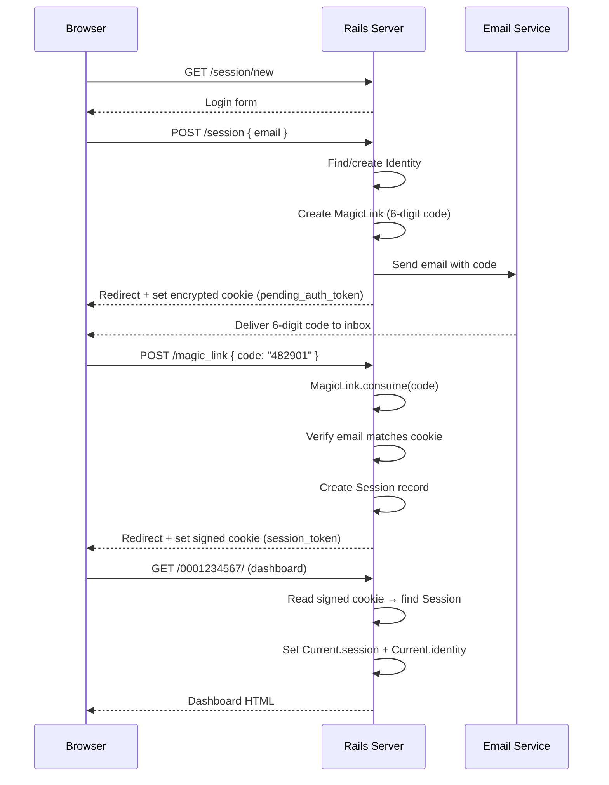
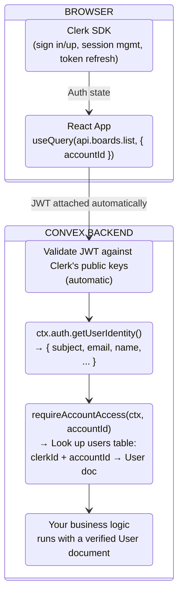
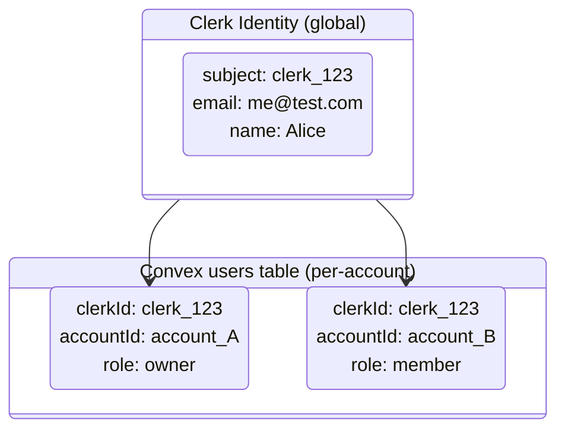

# Module 04 — Authentication

> **Goal:** Set up Clerk for authentication, integrate it with Convex, and implement the Identity → User mapping pattern.
>
> **Reference:** [docs/fizzy-analysis/03-authentication-and-sessions.md](../fizzy-analysis/03-authentication-and-sessions.md)

## How Fizzy Does It

Fizzy implements custom passwordless authentication from scratch. No passwords anywhere — users authenticate via 6-digit magic codes sent by email. The system needs **six database tables** and a stack of Rails controllers, concerns, and models to make this work.

### The Magic Link Flow



### The Six Auth Tables

Fizzy needs all of these to support the flow above:

| Table | Purpose | Key Fields |
|-------|---------|------------|
| `identities` | Global user (email-based, not tenant-scoped) | `email_address`, `verified` |
| `sessions` | Active browser session | `identity_id`, `user_agent`, `ip_address` |
| `magic_links` | Short-lived 6-digit codes | `identity_id`, `code`, `purpose`, `expires_at` |
| `signups` | New account registration state | `identity_id`, `account_name` |
| `access_tokens` | API bearer tokens | `identity_id`, `token`, `permission` |
| `join_codes` | Invitation links for joining accounts | `account_id`, `code`, `usage_count`, `usage_limit` |

On top of these tables, Fizzy needs:

- **`Authentication` concern** — included in every controller, handles session resume, cookie management, and bearer token fallback
- **Rate limiting** — 10 requests per 3 minutes on login/signup endpoints
- **Signed cookies** — `httponly`, `same_site: :lax`, using Rails' `signed_id`
- **Encrypted cookies** — for the pending auth token (prevents code-swap attacks)
- **Secure comparison** — `ActiveSupport::SecurityUtils.secure_compare` for email matching
- **Cleanup jobs** — recurring task every 4 hours to delete expired magic links

### Session Management

Every subsequent request after login follows this path:

1. Browser sends the `session_token` signed cookie
2. Rails reads the cookie, verifies the signature
3. Finds the `Session` record via `signed_id`
4. Sets `Current.session` and `Current.identity` (thread-locals)
5. Controllers access `Current.identity` to know who's making the request

This is ~300 lines of carefully written security code.

## What Clerk Eliminates

Every one of those six tables disappears:

| Fizzy Table | What It Does | Clerk Replacement |
|-------------|-------------|-------------------|
| `identities` | Stores email, verified flag | Clerk User (hosted) |
| `sessions` | Tracks browser sessions | Clerk session management |
| `magic_links` | Short-lived 6-digit codes | Clerk email OTP / magic links |
| `signups` | Registration state machine | Clerk sign-up flow |
| `access_tokens` | API bearer tokens | Clerk API tokens |
| `join_codes` | Invitation links | We handle this ourselves in Module 05 |

**Result:** 6 auth tables → 0 auth tables in our schema. We keep only the `users` table (account membership), which is a business concern, not an auth concern.

The `Authentication` concern, signed cookies, encrypted cookies, secure comparison, rate limiting, and magic link cleanup jobs all disappear too. Clerk handles all of it.

## Why Clerk

- **Passwordless auth** (magic links, email OTP) out of the box — matches Fizzy's approach
- **Built-in Convex integration** — JWT validation with zero plumbing
- **Session management** — token refresh, multi-device, secure cookies handled automatically
- **Organizations feature** — maps to Fizzy's accounts (optional — we'll manage accounts ourselves for flexibility)
- **Production-ready security** — rate limiting, bot detection, CSRF protection included

## How Convex + Clerk Work Together

Here is the full architecture for every authenticated request in our app:



The key insight: **we write zero auth plumbing**. The Clerk SDK attaches JWTs to every Convex request automatically. Convex validates them automatically. We only write the Identity → User lookup (the business logic part).

## Setup Clerk

### 1. Create a Clerk Application

Go to [clerk.com](https://clerk.com), create an account, and create a new application.

In the Clerk dashboard:
- **Application name:** Flat Earth
- **Sign-in options:** Enable **Email address** only
- **Email verification:** Enable **Email code** (this mimics Fizzy's magic link behavior)
- Disable password, username, phone, and social sign-in

### 2. Get Your Keys

From the Clerk dashboard, copy:
- **Publishable Key** (starts with `pk_`)
- **Clerk Domain** (e.g., `your-app.clerk.accounts.dev`)

### 3. Install Clerk

```bash
bun add @clerk/clerk-react
```

### 4. Configure Frontend Environment

Create `.env.local` in your project root with the Clerk publishable key:

```
VITE_CLERK_PUBLISHABLE_KEY=pk_test_your-key-here
```

This key is safe to expose in the browser — it only identifies your Clerk app.

## Configure Convex + Clerk

### 1. Set the Auth Config

Create the Convex auth configuration:

```typescript
// convex/auth.config.ts
export default {
  providers: [
    {
      domain: process.env.CLERK_ISSUER_URL,
    },
  ],
};
```

### 2. Set Environment Variables

First, get the Issuer URL from Clerk:

1. In the Clerk dashboard, go to **JWT Templates** (left sidebar)
2. Click **New template** → select **Convex**
3. The **Issuer** URL is displayed on the template page — this is your Clerk app's Frontend API URL (e.g., `https://verb-noun-00.clerk.accounts.dev`)
4. Save the template — the JWT token name must remain `convex` (do not rename it)

> **Important:** The Issuer URL is *not* the same as the Clerk Domain from the API Keys page. It comes specifically from the JWT Templates section.

Now set it in Convex. In the Convex dashboard (Settings → Environment Variables), set:

```
CLERK_ISSUER_URL=https://verb-noun-00.clerk.accounts.dev
```

Or via CLI:

```bash
bunx convex env set CLERK_ISSUER_URL https://verb-noun-00.clerk.accounts.dev
```

### 3. How JWT Validation Works

The flow:

```
1. User signs in with Clerk (browser)
2. Clerk issues a JWT (JSON Web Token)
3. Client sends JWT with every Convex request (automatic)
4. Convex validates the JWT against Clerk's public keys
5. Your server functions access the identity via ctx.auth
```

You don't write any of this plumbing. Convex and Clerk handle the JWT exchange automatically.

## Using `ctx.auth` in Server Functions

### Getting the Current Identity

```typescript
import { query } from "./_generated/server";

export const whoami = query({
  args: {},
  handler: async (ctx) => {
    const identity = await ctx.auth.getUserIdentity();

    if (!identity) {
      return null; // Not authenticated
    }

    return {
      clerkId: identity.subject,        // Clerk user ID (stable)
      email: identity.email,            // Email address
      name: identity.name,              // Display name (if set)
      tokenIdentifier: identity.tokenIdentifier, // Full identifier
    };
  },
});
```

`ctx.auth.getUserIdentity()` returns:
- `null` if the request is unauthenticated
- A `UserIdentity` object with Clerk user data if authenticated

The `subject` field is the Clerk user ID — this is stable across sessions and is what we store as `clerkId` in our `users` table.

### Requiring Authentication

Pattern for functions that require a logged-in user:

```typescript
import { query, mutation } from "./_generated/server";
import { ConvexError } from "convex/values";

// Helper: require authentication and return the identity
async function requireAuth(ctx: { auth: any }) {
  const identity = await ctx.auth.getUserIdentity();
  if (!identity) {
    throw new ConvexError("Not authenticated");
  }
  return identity;
}
```

## The Identity → User Mapping

This is the critical pattern. Clerk gives you a global identity (like Fizzy's `Identity`). But your app needs account-scoped users (like Fizzy's `User`).

### The Flow



One Clerk identity can have multiple User documents — one per account they belong to.

### The `requireAccountAccess` Helper

This is the most important helper in the entire app. Almost every function will call it:

```typescript
// convex/lib/auth.ts
import { QueryCtx, MutationCtx } from "../_generated/server";
import { ConvexError } from "convex/values";
import { Doc, Id } from "../_generated/dataModel";

export async function requireAccountAccess(
  ctx: QueryCtx | MutationCtx,
  accountId: Id<"accounts">,
): Promise<Doc<"users">> {
  // 1. Check Clerk authentication
  const identity = await ctx.auth.getUserIdentity();
  if (!identity) {
    throw new ConvexError("Not authenticated");
  }

  // 2. Check account exists
  const account = await ctx.db.get(accountId);
  if (!account) {
    throw new ConvexError("Account not found");
  }

  // 3. Check user has membership in this account
  const user = await ctx.db
    .query("users")
    .withIndex("by_account_clerk", (q) =>
      q.eq("accountId", accountId).eq("clerkId", identity.subject)
    )
    .unique();

  if (!user) {
    throw new ConvexError("Not a member of this account");
  }

  if (!user.active) {
    throw new ConvexError("User is deactivated");
  }

  return user;
}
```

This does three things in one call:
1. Verifies Clerk authentication (throws if no JWT)
2. Verifies the account exists (throws if bad ID)
3. Verifies the user belongs to that account and is active (throws with specific errors)

Usage in any function:

```typescript
export const listBoards = query({
  args: { accountId: v.id("accounts") },
  handler: async (ctx, { accountId }) => {
    const user = await requireAccountAccess(ctx, accountId);
    // user is guaranteed to be an active user in this account
    // ... fetch boards ...
  },
});
```

### First-Time User Setup

When a Clerk user first signs in, they don't have a User document yet. Handle account creation:

```typescript
// convex/accounts.ts
import { mutation } from "./_generated/server";
import { v } from "convex/values";
import { ConvexError } from "convex/values";

export const createWithOwner = mutation({
  args: {
    accountName: v.string(),
  },
  handler: async (ctx, { accountName }) => {
    const identity = await ctx.auth.getUserIdentity();
    if (!identity) {
      throw new ConvexError("Not authenticated");
    }

    // Create the account
    const accountId = await ctx.db.insert("accounts", {
      name: accountName,
      cardsCount: 0n,
    });

    // Create the owner user
    const userId = await ctx.db.insert("users", {
      accountId,
      clerkId: identity.subject,
      name: identity.name ?? "New User",
      role: "owner",
      active: true,
    });

    // Seed default data (board with columns)
    const boardId = await ctx.db.insert("boards", {
      accountId,
      name: "My First Board",
      creatorId: userId,
      allAccess: true,
    });

    const defaultColumns = [
      { name: "To Do", color: "#6366f1", position: 0 },
      { name: "In Progress", color: "#f59e0b", position: 1 },
      { name: "Done", color: "#22c55e", position: 2 },
    ];

    for (const col of defaultColumns) {
      await ctx.db.insert("columns", {
        accountId,
        boardId,
        ...col,
      });
    }

    // Grant owner access to the board
    await ctx.db.insert("accesses", {
      accountId,
      boardId,
      userId,
      involvement: "watching",
    });

    return { accountId, userId, boardId };
  },
});
```

> **Note:** `cardsCount` uses `0n` (BigInt literal) because the schema defines it as `v.int64()`. Using `0` instead of `0n` would cause a runtime type error.

### Listing Accounts for a Clerk User

When a user has multiple accounts, show an account picker:

```typescript
// convex/accounts.ts
export const listMyAccounts = query({
  args: {},
  handler: async (ctx) => {
    const identity = await ctx.auth.getUserIdentity();
    if (!identity) return [];

    const users = await ctx.db
      .query("users")
      .withIndex("by_clerk_id", (q) => q.eq("clerkId", identity.subject))
      .collect();

    const activeUsers = users.filter((u) => u.active);

    const accounts = await Promise.all(
      activeUsers.map(async (user) => {
        const account = await ctx.db.get(user.accountId);
        return account ? { ...account, role: user.role, userId: user._id } : null;
      })
    );

    return accounts.filter(Boolean);
  },
});
```

## Account Membership

Joining an existing account (via join codes or invitations) is a multi-tenancy concern. We cover the `join` mutation, join code management, and invitation flow in [Module 05 — Multi-Tenancy](./05-multi-tenancy.md).

## Authentication Patterns Summary

| Pattern | When to Use |
|---------|-------------|
| `ctx.auth.getUserIdentity()` | Raw Clerk identity access |
| `requireAccountAccess(ctx, accountId)` | Most functions — gets account-scoped user |
| `requireAuth(ctx)` | Functions that just need auth but not account context |
| Unauthenticated queries | Public board views, health checks |

Every query and mutation that reads or writes tenant data should call `requireAccountAccess` with the `accountId` argument. This is the Convex equivalent of Fizzy's `Current.user`.

## Fizzy's Approach vs Ours

| Aspect | Fizzy (Rails) | Flat Earth (Convex + Clerk) |
|--------|---------------|----------------------------|
| Auth method | Custom magic links (6-digit codes) | Clerk email OTP (same UX, zero code) |
| Auth tables | 6 (`identities`, `sessions`, `magic_links`, `signups`, `access_tokens`, `join_codes`) | 0 (all handled by Clerk) |
| Session storage | Signed cookies + `sessions` table | Clerk manages sessions + JWTs |
| Token validation | Rails `signed_id` + custom concern | Convex validates Clerk JWTs automatically |
| Identity model | `Identity` record (email-based) | Clerk User (hosted) |
| User model | `User` record (account-scoped) | Same — `users` table with `clerkId` + `accountId` |
| Multi-account switching | Signed transfer IDs (4-hour expiry) | Same Clerk session, switch `accountId` in frontend |
| Rate limiting | Custom `rate_limit` controller macro | Clerk built-in bot/abuse protection |
| API auth | Bearer tokens via `access_tokens` table | Clerk API tokens |
| Security code | ~300 lines of concerns, models, controllers | ~30 lines (`requireAccountAccess` helper) |

## Exercise: Set Up Authentication

### Part 1 — Clerk Setup (~10 min)

1. Create a Clerk app at [clerk.com](https://clerk.com) with email-only sign-in
2. Add your Clerk publishable key to `.env.local`
3. Install `@clerk/clerk-react`

### Part 2 — Convex Integration (~5 min)

1. Create `convex/auth.config.ts` with your Clerk domain
2. Set the `CLERK_ISSUER_URL` environment variable in the Convex dashboard

### Part 3 — Auth Helper (~15 min)

1. Write the `requireAccountAccess` helper in `convex/lib/auth.ts`
2. Make sure it checks: authentication → account existence → membership → active status
3. Use separate error messages for each failure case

### Part 4 — Account Creation (~15 min)

1. Write `createWithOwner` mutation in `convex/accounts.ts` — creates an account, owner user, and default board with columns
2. Remember: `cardsCount: 0n` (BigInt), not `cardsCount: 0`
3. Write `listMyAccounts` query that returns all accounts for the current Clerk user

### Part 5 — Verify (~5 min)

1. Run `bunx convex dev` and confirm all functions deploy without errors
2. Open the Convex dashboard → Functions tab
3. Call `createWithOwner` and `listMyAccounts` to verify they compile and appear in the dashboard

End-to-end testing with real Clerk tokens happens when we wire up the frontend in Module 12.

---

Next: [Module 05 — Multi-Tenancy](./05-multi-tenancy.md)
