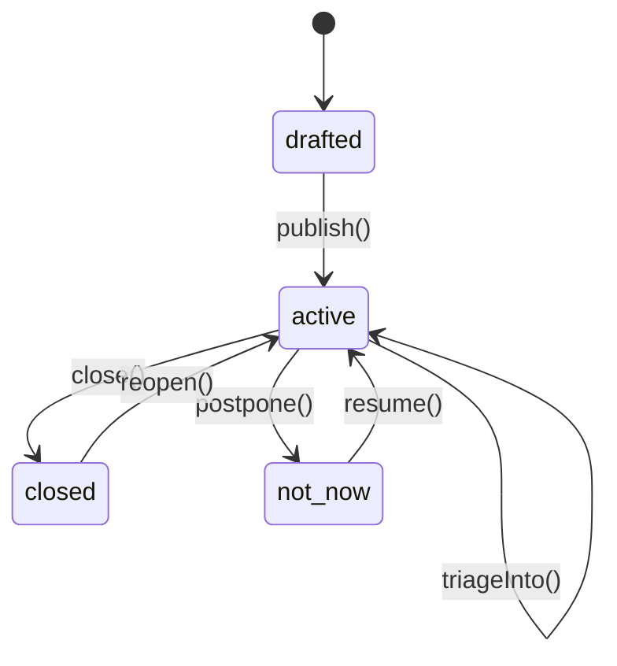

# Module 07 — Card Lifecycle: State Machine

> **What you'll see running:** Status badges on cards, action buttons (Publish, Close, Reopen, Postpone, Resume), filtered views for active/closed/postponed cards, and a triage area — all reflecting the card's derived state.
>
> **References:** [docs/fizzy-analysis/02-domain-models.md](../fizzy-analysis/02-domain-models.md), [docs/fizzy-analysis/06-features.md](../fizzy-analysis/06-features.md)

## The State Machine

Fizzy's card lifecycle is derived from multiple fields, not a single status column:



### Derived Status

The `status` field only stores `"drafted"` or `"published"`. The effective state is computed:

```typescript
// convex/lib/cardStatus.ts
import { Doc } from "../_generated/dataModel";

export type EffectiveStatus =
  | "drafted"
  | "active"
  | "closed"
  | "not_now"
  | "triage";

export function getEffectiveStatus(card: Doc<"cards">): EffectiveStatus {
  if (card.status === "drafted") return "drafted";
  if (card.closedAt) return "closed";
  if (card.postponedAt) return "not_now";
  if (card.columnId === null) return "triage";
  return "active";
}
```

Why not a single `status` field? Because Fizzy tracks *who* and *when* for closures and postponements, and supports operations like "reopen" that restore previous state.

## Lifecycle Mutations

All lifecycle mutations live in a subdirectory for organization:

```typescript
// convex/cards/lifecycle.ts
import { mutation } from "../_generated/server";
import { v, ConvexError } from "convex/values";
import { requireAccountAccess } from "../lib/auth";

export const publish = mutation({
  args: { accountId: v.id("accounts"), cardId: v.id("cards") },
  handler: async (ctx, { accountId, cardId }) => {
    const user = await requireAccountAccess(ctx, accountId);
    const card = await ctx.db.get(cardId);
    if (!card || card.accountId !== accountId) throw new ConvexError("Card not found");
    if (card.status !== "drafted") throw new ConvexError("Only drafted cards can be published");

    const title = card.title.trim() || `Card #${card.number}`;
    await ctx.db.patch(cardId, {
      status: "published",
      title,
      lastActiveAt: Date.now(),
    });

    await ctx.db.insert("events", {
      accountId,
      boardId: card.boardId,
      creatorId: user._id,
      action: "card_published",
      eventable: { type: "card", id: cardId },
    });
  },
});

export const close = mutation({
  args: { accountId: v.id("accounts"), cardId: v.id("cards") },
  handler: async (ctx, { accountId, cardId }) => {
    const user = await requireAccountAccess(ctx, accountId);
    const card = await ctx.db.get(cardId);
    if (!card || card.accountId !== accountId) throw new ConvexError("Card not found");
    if (card.status !== "published") throw new ConvexError("Can only close published cards");
    if (card.closedAt) throw new ConvexError("Already closed");

    const patch: Record<string, any> = {
      closedAt: Date.now(),
      closedBy: user._id,
      lastActiveAt: Date.now(),
    };
    if (card.postponedAt) {
      patch.postponedAt = undefined;
      patch.postponedBy = undefined;
    }

    await ctx.db.patch(cardId, patch);
    await ctx.db.insert("events", {
      accountId, boardId: card.boardId, creatorId: user._id,
      action: "card_closed", eventable: { type: "card", id: cardId },
    });
  },
});

export const reopen = mutation({
  args: { accountId: v.id("accounts"), cardId: v.id("cards") },
  handler: async (ctx, { accountId, cardId }) => {
    const user = await requireAccountAccess(ctx, accountId);
    const card = await ctx.db.get(cardId);
    if (!card || card.accountId !== accountId) throw new ConvexError("Card not found");
    if (!card.closedAt) throw new ConvexError("Card is not closed");

    await ctx.db.patch(cardId, {
      closedAt: undefined, closedBy: undefined, lastActiveAt: Date.now(),
    });
    await ctx.db.insert("events", {
      accountId, boardId: card.boardId, creatorId: user._id,
      action: "card_reopened", eventable: { type: "card", id: cardId },
    });
  },
});

export const postpone = mutation({
  args: { accountId: v.id("accounts"), cardId: v.id("cards") },
  handler: async (ctx, { accountId, cardId }) => {
    const user = await requireAccountAccess(ctx, accountId);
    const card = await ctx.db.get(cardId);
    if (!card || card.accountId !== accountId) throw new ConvexError("Card not found");
    if (card.status !== "published") throw new ConvexError("Can only postpone published cards");
    if (card.postponedAt) throw new ConvexError("Already postponed");

    await ctx.db.patch(cardId, {
      postponedAt: Date.now(),
      postponedBy: user._id,
      columnId: null,
      closedAt: undefined,
      closedBy: undefined,
      activitySpikeAt: undefined,
      lastActiveAt: Date.now(),
    });
    await ctx.db.insert("events", {
      accountId, boardId: card.boardId, creatorId: user._id,
      action: "card_postponed", eventable: { type: "card", id: cardId },
    });
  },
});

export const resume = mutation({
  args: { accountId: v.id("accounts"), cardId: v.id("cards") },
  handler: async (ctx, { accountId, cardId }) => {
    const user = await requireAccountAccess(ctx, accountId);
    const card = await ctx.db.get(cardId);
    if (!card || card.accountId !== accountId) throw new ConvexError("Card not found");
    if (!card.postponedAt) throw new ConvexError("Card is not postponed");

    await ctx.db.patch(cardId, {
      postponedAt: undefined, postponedBy: undefined,
      closedAt: undefined, closedBy: undefined,
      activitySpikeAt: undefined, lastActiveAt: Date.now(),
    });
    await ctx.db.insert("events", {
      accountId, boardId: card.boardId, creatorId: user._id,
      action: "card_resumed", eventable: { type: "card", id: cardId },
    });
  },
});

export const triageInto = mutation({
  args: {
    accountId: v.id("accounts"),
    cardId: v.id("cards"),
    columnId: v.id("columns"),
  },
  handler: async (ctx, { accountId, cardId, columnId }) => {
    const user = await requireAccountAccess(ctx, accountId);
    const card = await ctx.db.get(cardId);
    if (!card || card.accountId !== accountId) throw new ConvexError("Card not found");

    const column = await ctx.db.get(columnId);
    if (!column || column.boardId !== card.boardId) {
      throw new ConvexError("Column not on this board");
    }

    const patch: Record<string, any> = { columnId, lastActiveAt: Date.now() };
    if (card.postponedAt) {
      patch.postponedAt = undefined;
      patch.postponedBy = undefined;
      patch.activitySpikeAt = undefined;
    }

    await ctx.db.patch(cardId, patch);
    await ctx.db.insert("events", {
      accountId, boardId: card.boardId, creatorId: user._id,
      action: "card_triaged", eventable: { type: "card", id: cardId },
      particulars: { column: column.name },
    });
  },
});

export const toggleGolden = mutation({
  args: { accountId: v.id("accounts"), cardId: v.id("cards") },
  handler: async (ctx, { accountId, cardId }) => {
    await requireAccountAccess(ctx, accountId);
    const card = await ctx.db.get(cardId);
    if (!card || card.accountId !== accountId) throw new ConvexError("Card not found");
    await ctx.db.patch(cardId, { isGolden: !card.isGolden });
  },
});
```

## Lifecycle Queries

```typescript
// convex/cards.ts (add to existing file)

export const listActive = query({
  args: { accountId: v.id("accounts"), boardId: v.id("boards") },
  handler: async (ctx, { accountId, boardId }) => {
    await requireAccountAccess(ctx, accountId);
    const cards = await ctx.db
      .query("cards")
      .withIndex("by_board", (q) => q.eq("boardId", boardId))
      .collect();
    return cards.filter(
      (c) => c.status === "published" && !c.closedAt && !c.postponedAt
    );
  },
});

export const listClosed = query({
  args: { accountId: v.id("accounts"), boardId: v.id("boards") },
  handler: async (ctx, { accountId, boardId }) => {
    await requireAccountAccess(ctx, accountId);
    const cards = await ctx.db
      .query("cards")
      .withIndex("by_board", (q) => q.eq("boardId", boardId))
      .collect();
    return cards
      .filter((c) => c.closedAt !== undefined)
      .sort((a, b) => (b.closedAt ?? 0) - (a.closedAt ?? 0));
  },
});

export const listPostponed = query({
  args: { accountId: v.id("accounts"), boardId: v.id("boards") },
  handler: async (ctx, { accountId, boardId }) => {
    await requireAccountAccess(ctx, accountId);
    const cards = await ctx.db
      .query("cards")
      .withIndex("by_board", (q) => q.eq("boardId", boardId))
      .collect();
    return cards.filter((c) => c.postponedAt !== undefined);
  },
});
```

## TypeScript in Context: Type Narrowing and Exhaustive Switch

The `getEffectiveStatus` helper demonstrates type narrowing. Use an exhaustive switch to ensure all cases are handled:

```typescript
function getStatusColor(status: EffectiveStatus): string {
  switch (status) {
    case "drafted": return "gray";
    case "active": return "blue";
    case "triage": return "amber";
    case "closed": return "green";
    case "not_now": return "orange";
    // If you add a new status, TypeScript will error here
    default: {
      const _exhaustive: never = status;
      return _exhaustive;
    }
  }
}
```

## Frontend: Status Badges

```tsx
// src/components/StatusBadge.tsx
const STATUS_STYLES: Record<string, string> = {
  drafted: "bg-gray-100 text-gray-700",
  active: "bg-blue-100 text-blue-700",
  triage: "bg-amber-100 text-amber-700",
  closed: "bg-green-100 text-green-700",
  not_now: "bg-orange-100 text-orange-700",
};

export function StatusBadge({ status }: { status: string }) {
  return (
    <span
      className={`inline-flex rounded-full px-2 py-0.5 text-xs font-medium ${STATUS_STYLES[status] ?? "bg-gray-100"}`}
    >
      {status.replace("_", " ")}
    </span>
  );
}
```

## Frontend: Action Buttons

```tsx
// src/components/CardActions.tsx
import { useMutation } from "convex/react";
import { api } from "../../convex/_generated/api";
import { Id } from "../../convex/_generated/dataModel";
import { Button } from "./ui/button";

export function CardActions({
  accountId,
  card,
}: {
  accountId: Id<"accounts">;
  card: any;
}) {
  const publish = useMutation(api.cards.lifecycle.publish);
  const close = useMutation(api.cards.lifecycle.close);
  const reopen = useMutation(api.cards.lifecycle.reopen);
  const postpone = useMutation(api.cards.lifecycle.postpone);
  const resume = useMutation(api.cards.lifecycle.resume);
  const toggleGolden = useMutation(api.cards.lifecycle.toggleGolden);

  const args = { accountId, cardId: card._id };

  // Determine effective status
  const isDrafted = card.status === "drafted";
  const isClosed = !!card.closedAt;
  const isPostponed = !!card.postponedAt;
  const isActive = card.status === "published" && !isClosed && !isPostponed;

  return (
    <div className="flex flex-wrap gap-2">
      {isDrafted && (
        <Button size="sm" onClick={() => publish(args)}>
          Publish
        </Button>
      )}
      {isActive && (
        <>
          <Button size="sm" variant="outline" onClick={() => close(args)}>
            Close
          </Button>
          <Button size="sm" variant="outline" onClick={() => postpone(args)}>
            Not Now
          </Button>
        </>
      )}
      {isClosed && (
        <Button size="sm" variant="outline" onClick={() => reopen(args)}>
          Reopen
        </Button>
      )}
      {isPostponed && (
        <Button size="sm" variant="outline" onClick={() => resume(args)}>
          Resume
        </Button>
      )}
      <Button
        size="sm"
        variant="ghost"
        onClick={() => toggleGolden(args)}
      >
        {card.isGolden ? "★ Golden" : "☆ Star"}
      </Button>
    </div>
  );
}
```

## Frontend: Filtered Views

Add tabs to the board page for different views:

```tsx
function BoardTabs({
  accountId,
  boardId,
}: {
  accountId: Id<"accounts">;
  boardId: Id<"boards">;
}) {
  const [view, setView] = useState<"board" | "closed" | "postponed">("board");
  const closedCards = useQuery(
    api.cards.listClosed,
    view === "closed" ? { accountId, boardId } : "skip"
  );
  const postponedCards = useQuery(
    api.cards.listPostponed,
    view === "postponed" ? { accountId, boardId } : "skip"
  );

  return (
    <div>
      <div className="mb-4 flex gap-2">
        <Button
          variant={view === "board" ? "default" : "ghost"}
          size="sm"
          onClick={() => setView("board")}
        >
          Board
        </Button>
        <Button
          variant={view === "closed" ? "default" : "ghost"}
          size="sm"
          onClick={() => setView("closed")}
        >
          Closed
        </Button>
        <Button
          variant={view === "postponed" ? "default" : "ghost"}
          size="sm"
          onClick={() => setView("postponed")}
        >
          Not Now
        </Button>
      </div>

      {view === "board" && <KanbanView /* ... */ />}
      {view === "closed" && (
        <CardList cards={closedCards} emptyMessage="No closed cards." />
      )}
      {view === "postponed" && (
        <CardList cards={postponedCards} emptyMessage="No postponed cards." />
      )}
    </div>
  );
}
```

## Transition Validation Summary

| From → To | Allowed | Mutation |
|-----------|---------|----------|
| drafted → published | Yes | `publish` |
| active → closed | Yes | `close` |
| active → not_now | Yes | `postpone` |
| active → triage | Yes | `moveToColumn(null)` |
| triage → active (column) | Yes | `triageInto` |
| closed → active | Yes | `reopen` |
| not_now → active | Yes | `resume` |
| not_now → closed | Yes | `close` (clears postponement) |
| closed → not_now | No | Reopen first |
| drafted → closed | No | Must publish first |

## Exercise

1. Create `convex/lib/cardStatus.ts` with `getEffectiveStatus`
2. Create `convex/cards/lifecycle.ts` with all lifecycle mutations
3. Add lifecycle queries to `convex/cards.ts`: `listActive`, `listClosed`, `listPostponed`
4. Build `StatusBadge` and `CardActions` components
5. Add filtered views (Board / Closed / Not Now tabs) to the board page
6. Test the full lifecycle: create → publish → triage → close → reopen → postpone → resume
7. Test invalid transitions: try closing a draft (should fail), try publishing twice (should fail)

**Result:** Cards with visible status badges, action buttons that enforce valid transitions, and filtered views for closed/postponed cards.

---

Next: [Module 08 — Permissions & Access Control](./08-permissions.md)
