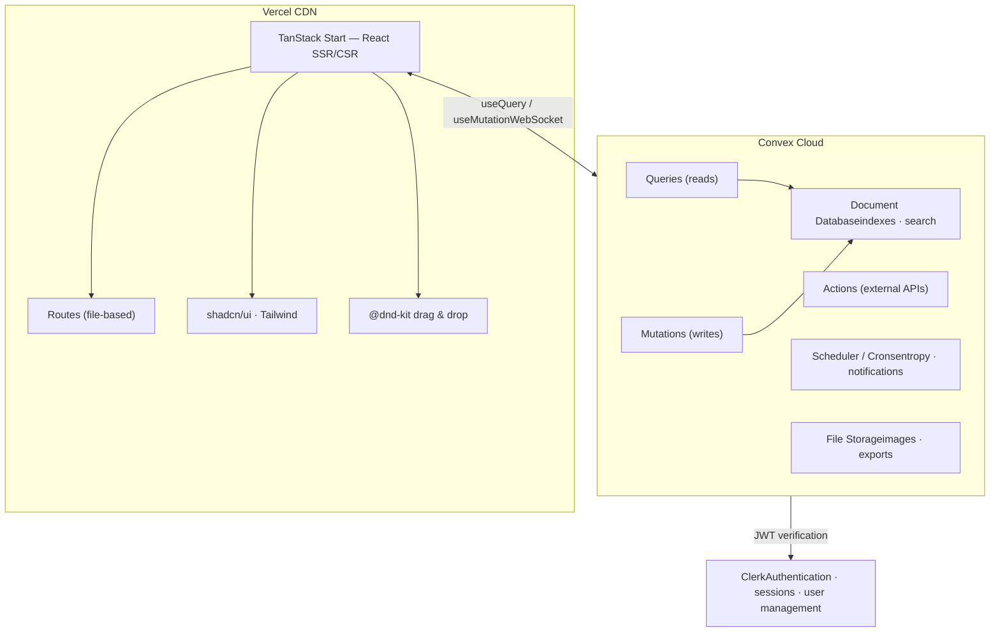

# Module 13 — What's Next

> You've built a production kanban app with real-time updates, role-based access, drag-and-drop, background jobs, and deployment. Here's where to go from here.

## Webhooks

Fizzy fires webhooks to external services when events occur. Here's the Convex pattern:

### Webhook Schema (already in our schema)

```typescript
webhooks: defineTable({
  accountId: v.id("accounts"),
  boardId: v.id("boards"),
  name: v.string(),
  url: v.string(),
  signingSecret: v.string(),
  subscribedActions: v.array(v.string()),
  active: v.boolean(),
}).index("by_board", ["boardId"]),

webhookDeliveries: defineTable({
  accountId: v.id("accounts"),
  webhookId: v.id("webhooks"),
  eventId: v.id("events"),
  state: v.union(
    v.literal("pending"),
    v.literal("in_progress"),
    v.literal("completed"),
    v.literal("errored"),
  ),
  request: v.optional(v.string()),
  response: v.optional(v.string()),
}).index("by_webhook", ["webhookId"]),
```

### Dispatching Webhooks

When an event is created, find matching webhooks and schedule deliveries:

```typescript
// convex/webhooks.ts
import { internalMutation, internalAction } from "./_generated/server";
import { v } from "convex/values";
import { internal } from "./_generated/api";

export const dispatch = internalMutation({
  args: { eventId: v.id("events") },
  handler: async (ctx, { eventId }) => {
    const event = await ctx.db.get(eventId);
    if (!event) return;

    const webhooks = await ctx.db
      .query("webhooks")
      .withIndex("by_board", (q) => q.eq("boardId", event.boardId))
      .collect();

    const matching = webhooks.filter(
      (w) => w.active && w.subscribedActions.includes(event.action)
    );

    for (const webhook of matching) {
      const deliveryId = await ctx.db.insert("webhookDeliveries", {
        accountId: event.accountId,
        webhookId: webhook._id,
        eventId,
        state: "pending",
      });

      await ctx.scheduler.runAfter(0, internal.webhooks.deliver, {
        deliveryId,
      });
    }
  },
});
```

### Delivering with Signing

```typescript
export const deliver = internalAction({
  args: { deliveryId: v.id("webhookDeliveries") },
  handler: async (ctx, { deliveryId }) => {
    const delivery = await ctx.runQuery(internal.webhooks.getDelivery, {
      deliveryId,
    });
    if (!delivery || delivery.state !== "pending") return;

    await ctx.runMutation(internal.webhooks.updateState, {
      deliveryId,
      state: "in_progress",
    });

    const webhook = await ctx.runQuery(internal.webhooks.getWebhook, {
      webhookId: delivery.webhookId,
    });
    if (!webhook) return;

    const event = await ctx.runQuery(internal.events.getById, {
      eventId: delivery.eventId,
    });

    const payload = JSON.stringify({
      event: event?.action,
      data: event,
      timestamp: Date.now(),
    });

    // HMAC signing
    const encoder = new TextEncoder();
    const key = await crypto.subtle.importKey(
      "raw",
      encoder.encode(webhook.signingSecret),
      { name: "HMAC", hash: "SHA-256" },
      false,
      ["sign"]
    );
    const signature = await crypto.subtle.sign(
      "HMAC",
      key,
      encoder.encode(payload)
    );
    const signatureHex = Array.from(new Uint8Array(signature))
      .map((b) => b.toString(16).padStart(2, "0"))
      .join("");

    try {
      const response = await fetch(webhook.url, {
        method: "POST",
        headers: {
          "Content-Type": "application/json",
          "X-Webhook-Signature": signatureHex,
        },
        body: payload,
      });

      await ctx.runMutation(internal.webhooks.updateState, {
        deliveryId,
        state: response.ok ? "completed" : "errored",
        response: `${response.status} ${response.statusText}`,
      });
    } catch (error) {
      await ctx.runMutation(internal.webhooks.updateState, {
        deliveryId,
        state: "errored",
        response: String(error),
      });
    }
  },
});
```

## File Uploads

Convex has a built-in storage API for file uploads. The card schema already includes `imageId: v.optional(v.id("_storage"))`.

### Upload Flow

```typescript
// convex/cards.ts
export const generateUploadUrl = mutation({
  args: { accountId: v.id("accounts") },
  handler: async (ctx, { accountId }) => {
    await requireAccountAccess(ctx, accountId);
    return ctx.storage.generateUploadUrl();
  },
});

export const attachImage = mutation({
  args: {
    accountId: v.id("accounts"),
    cardId: v.id("cards"),
    storageId: v.id("_storage"),
  },
  handler: async (ctx, { accountId, cardId, storageId }) => {
    await requireAccountAccess(ctx, accountId);
    const card = await ctx.db.get(cardId);
    if (!card || card.accountId !== accountId) {
      throw new ConvexError("Card not found");
    }
    await ctx.db.patch(cardId, { imageId: storageId });
  },
});
```

### Frontend Upload Component

```tsx
import { useMutation } from "convex/react";
import { api } from "../../convex/_generated/api";

function ImageUpload({ accountId, cardId }) {
  const generateUploadUrl = useMutation(api.cards.generateUploadUrl);
  const attachImage = useMutation(api.cards.attachImage);

  async function handleUpload(e: React.ChangeEvent<HTMLInputElement>) {
    const file = e.target.files?.[0];
    if (!file) return;

    // Step 1: Get a short-lived upload URL
    const uploadUrl = await generateUploadUrl({ accountId });

    // Step 2: Upload the file directly to Convex storage
    const result = await fetch(uploadUrl, {
      method: "POST",
      headers: { "Content-Type": file.type },
      body: file,
    });
    const { storageId } = await result.json();

    // Step 3: Attach the storage ID to the card
    await attachImage({ accountId, cardId, storageId });
  }

  return <input type="file" accept="image/*" onChange={handleUpload} />;
}
```

### Displaying Images

```tsx
// Use ctx.storage.getUrl() in a query, or the useQuery hook
export const getImageUrl = query({
  args: { storageId: v.id("_storage") },
  handler: async (ctx, { storageId }) => {
    return ctx.storage.getUrl(storageId);
  },
});
```

## Testing Strategies

### Unit Testing Convex Functions

Convex provides test helpers for running functions in an isolated environment:

```typescript
// convex/tests/cards.test.ts
import { convexTest } from "convex-test";
import { expect, test } from "vitest";
import { api } from "./_generated/api";
import schema from "./schema";

test("creating a card increments account counter", async () => {
  const t = convexTest(schema);

  // Seed test data
  const accountId = await t.run(async (ctx) => {
    return ctx.db.insert("accounts", { name: "Test", cardsCount: 0 });
  });

  const userId = await t.run(async (ctx) => {
    return ctx.db.insert("users", {
      accountId,
      clerkId: "test_clerk",
      name: "Test User",
      role: "owner",
      active: true,
    });
  });

  // Call the mutation (with auth mocked)
  await t.mutation(api.cards.create, {
    accountId,
    boardId: /* ... */,
    title: "Test Card",
  });

  // Verify
  const account = await t.run(async (ctx) => ctx.db.get(accountId));
  expect(account?.cardsCount).toBe(1);
});
```

### Frontend Testing

For React component testing, use Vitest + React Testing Library with a mocked Convex provider:

```typescript
import { render, screen } from "@testing-library/react";
import { ConvexProvider } from "convex/react";
import { StatusBadge } from "./StatusBadge";

test("renders status badge with correct style", () => {
  render(<StatusBadge status="active" />);
  expect(screen.getByText("active")).toBeInTheDocument();
});
```

For end-to-end tests, Playwright works well with TanStack Start:

```typescript
// e2e/board.spec.ts
import { test, expect } from "@playwright/test";

test("can create a board", async ({ page }) => {
  await page.goto("/");
  // ... sign in flow
  await page.fill('[placeholder="New board name"]', "My Board");
  await page.click("text=Create Board");
  await expect(page.locator("text=My Board")).toBeVisible();
});
```

## Scaling Considerations

### Convex Limits

| Resource | Limit |
|----------|-------|
| Document size | 1 MB |
| Query/mutation duration | 10 seconds (configurable for actions) |
| Scheduled functions | At-least-once delivery |
| Database size | Scales automatically |
| Concurrent connections | Scales automatically |

### Patterns for Scale

- **Paginate large lists** — use `usePaginatedQuery` (Module 11) instead of loading all records
- **Granular subscriptions** — per-column queries instead of per-board (Module 06)
- **Skip unused subscriptions** — pass `"skip"` to `useQuery` when data isn't needed
- **Batch writes** — multiple `ctx.db.patch` calls in a single mutation are transactional
- **Index design** — compound indexes serve multiple query patterns with a single index

### When Convex Might Not Fit

- **Massive analytical queries** — Convex is optimized for transactional workloads, not OLAP
- **Binary data processing** — Use actions to offload to external services
- **Multi-region requirements** — Convex runs in a single region (as of 2025)

## Architecture Recap



## What We Built (Module by Module)

| Module | What You Added |
|--------|---------------|
| 01 | TanStack Start + Tailwind + shadcn/ui scaffold |
| 02 | Convex backend, first real-time query + mutation |
| 03 | Clerk authentication, protected routes |
| 04 | Full schema, multi-tenancy, account picker |
| 05 | Board and column CRUD with UI |
| 06 | Card CRUD, kanban board, drag-and-drop |
| 07 | Card lifecycle state machine, status badges |
| 08 | Permissions, access control, public boards |
| 09 | Comments, reactions, mentions, tags, pins, watches |
| 10 | Entropy auto-postpone, notifications, cron jobs |
| 11 | Error handling, pagination, search, polish |
| 12 | Production deployment (Convex + Clerk + Vercel) |

## Official Documentation

- **Convex:** [docs.convex.dev](https://docs.convex.dev) — functions, schema, indexes, scheduling, storage, auth
- **TanStack Start:** [tanstack.com/start](https://tanstack.com/start/latest) — routing, server functions, SSR
- **TanStack Router:** [tanstack.com/router](https://tanstack.com/router/latest) — file-based routing, type-safe params, loaders
- **Clerk:** [clerk.com/docs](https://clerk.com/docs) — authentication, user management, organizations
- **Tailwind CSS:** [tailwindcss.com/docs](https://tailwindcss.com/docs) — utility classes, configuration
- **shadcn/ui:** [ui.shadcn.com](https://ui.shadcn.com) — component reference, theming
- **dnd kit:** [dndkit.com](https://dndkit.com) — drag-and-drop API

## Ideas for Extending Flat Earth

- **Rich text editing** — Add Tiptap or Plate for card descriptions and comments
- **Activity feed** — Show recent events across all boards on the account dashboard
- **Keyboard shortcuts** — Navigate boards and cards without a mouse
- **Dark mode** — Toggle Tailwind's dark variant via a theme context
- **Export** — Generate CSV/JSON exports of board data using a Convex action
- **Mobile layout** — Responsive kanban that stacks columns on small screens
- **Web push notifications** — Use the Push API with Convex actions for real-time alerts
- **AI card suggestions** — Use a Convex action to call an LLM for card summarization or triage suggestions
